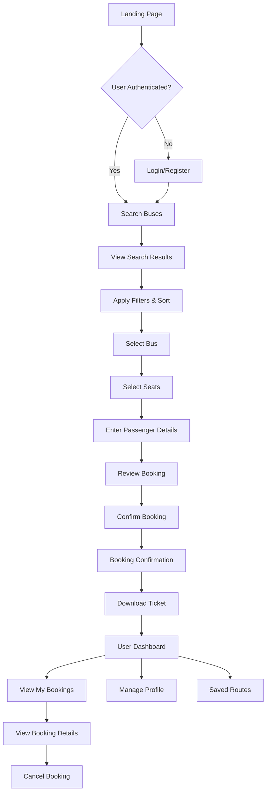
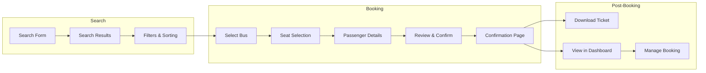
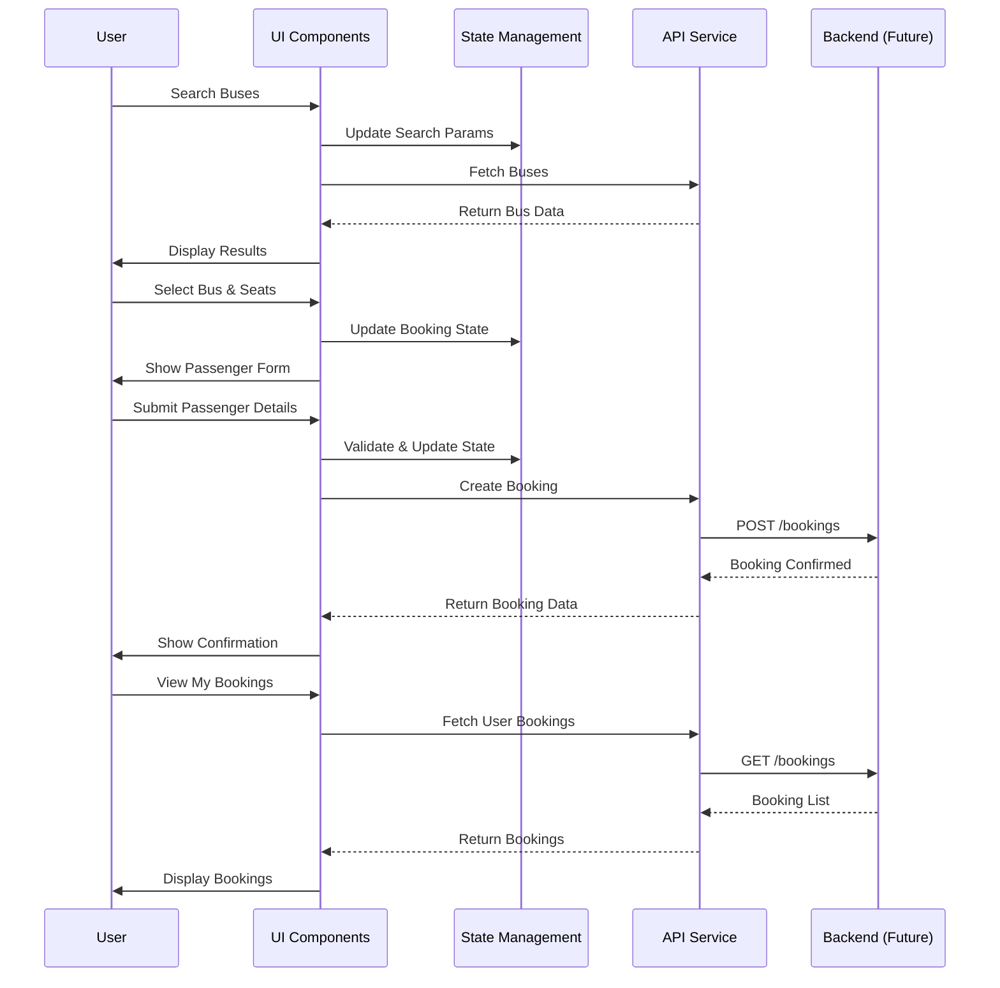
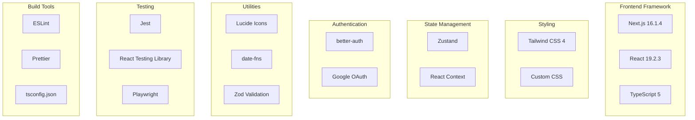

# BusGo - System Architecture Diagrams

## User Flow Diagram



## Booking Flow Diagram



## Component Architecture

```mermaid
graph TB
    subgraph Pages
        LP[Landing Page]
        LG[Login]
        LR[Register]
        SR[Search Results]
        SS[Seat Selection]
        PD[Passenger Details]
        BC[Booking Confirmation]
        DB[Dashboard]
        MB[My Bookings]
        BD[Booking Details]
        UP[User Profile]
    end

    subgraph Components
        NB[Navbar]
        HS[HeroSection]
        FR[FeaturedRoutes]
        BE[Benefits]
        TE[Testimonials]
        FT[Footer]
        BCARD[BusCard]
        FS[FilterSidebar]
        SL[SeatLayout]
        PF[PassengerForm]
        TC[TicketCard]
        DSB[DashboardSidebar]
        BL[BookingList]
        PI[ProfileInfo]
    end

    subgraph UI Components
        BTN[Button]
        INP[Input]
        MOD[Modal]
        TST[Toast]
        SKL[Skeleton]
        CRD[Card]
    end

    subgraph State Management
        BS[BookingStore]
        US[UserStore]
        FS[FilterStore]
    end

    subgraph Services
        API[API Service]
        AUTH[Auth Service]
    end

    LP --> NB
    LP --> HS
    LP --> FR
    LP --> BE
    LP --> TE
    LP --> FT

    SR --> BCARD
    SR --> FS

    SS --> SL

    PD --> PF

    BC --> TC

    DB --> DSB
    MB --> BL
    BD --> TC
    UP --> PI

    BCARD --> CRD
    SL --> BTN
    PF --> INP
    TC --> CRD

    SS --> BS
    PD --> BS
    MB --> US
    SR --> FS

    LG --> AUTH
    LR --> AUTH
    SR --> API
```



## Data Flow Diagram



## File Structure Diagram

```mermaid
graph TD
    ROOT[app/]
    ROOT --> AUTH[(auth)/]
    ROOT --> DASH[(dashboard)/]
    ROOT --> BOOKING[booking/]
    ROOT --> OPERATOR[operator/]
    ROOT --> SEARCH[search/]
    ROOT --> STATIC[Static Pages]
    ROOT --> COMPS[components/]
    ROOT --> STORE[store/]
    ROOT --> HOOKS[hooks/]
    ROOT --> TYPES[types/]
    ROOT --> SERVICES[services/]
    ROOT --> CONFIG[Config Files]

    AUTH --> LOGIN[login/]
    AUTH --> REGISTER[register/]

    DASH --> BOOKINGS[bookings/]
    DASH --> PROFILE[profile/]
    DASH --> SAVED[saved-routes/]

    BOOKING --> SEATS[seats/]
    BOOKING --> PASSENGER[passenger/]
    BOOKING --> CONFIRM[confirmation/]

    COMPS --> BOOKING_COMPS[Booking/]
    COMPS --> SEARCH_COMPS[BusSearch/]
    COMPS --> DASH_COMPS[Dashboard/]
    COMPS --> UI_COMPS[UI/]
    COMPS --> LANDING[LandingPage/]

    STATIC --> ABOUT[about/]
    STATIC --> CONTACT[contact/]
    STATIC --> FAQ[faq/]
    STATIC --> TERMS[terms/]
    STATIC --> PRIVACY[privacy/]
```

## State Management Structure

```mermaid
graph TB
    subgraph Zustand Stores
        BS[BookingStore]
        US[UserStore]
        FS[FilterStore]
        UIS[UIStore]
    end

    subgraph BookingStore State
        B1[selectedBus]
        B2[selectedSeats]
        B3[passengers]
        B4[bookingData]
        B5[bookingStatus]
    end

    subgraph UserStore State
        U1[user]
        U2[isAuthenticated]
        U3[bookings]
        U4[savedRoutes]
    end

    subgraph FilterStore State
        F1[priceRange]
        F2[busTypes]
        F3[timeSlots]
        F4[operators]
        F5[sortBy]
    end

    subgraph UIStore State
        I1[theme]
        I2[sidebarOpen]
        I3[loading]
        I4[errors]
        I5[toasts]
    end

    BS --> B1
    BS --> B2
    BS --> B3
    BS --> B4
    BS --> B5

    US --> U1
    US --> U2
    US --> U3
    US --> U4

    FS --> F1
    FS --> F2
    FS --> F3
    FS --> F4
    FS --> F5

    UIS --> I1
    UIS --> I2
    UIS --> I3
    UIS --> I4
    UIS --> I5
```



## Page Route Structure

```mermaid
graph LR
    HOME[/]
    HOME --> LOGIN[/login]
    HOME --> REGISTER[/register]
    HOME --> SEARCH[/search]
    SEARCH --> SEATS[/booking/id/seats]
    SEATS --> PASSENGER[/booking/id/passenger]
    PASSENGER --> CONFIRM[/booking/id/confirmation]
    HOME --> DASH[/dashboard]
    DASH --> BOOKINGS[/dashboard/bookings]
    BOOKINGS --> DETAILS[/dashboard/bookings/id]
    DASH --> PROFILE[/dashboard/profile]
    DASH --> SAVED[/dashboard/saved-routes]
    HOME --> ABOUT[/about]
    HOME --> CONTACT[/contact]
    HOME --> FAQ[/faq]
    HOME --> TERMS[/terms]
    HOME --> PRIVACY[/privacy]
```

## Component Hierarchy

```mermaid
graph TB
    App[Next.js App]

    subgraph Layout
        Layout[Root Layout]
        Navbar[Navbar]
        Footer[Footer]
    end

    subgraph Auth Pages
        LoginPage[Login Page]
        RegisterPage[Register Page]
    end

    subgraph Public Pages
        HomePage[Home Page]
        SearchPage[Search Page]
        AboutPage[About Page]
        ContactPage[Contact Page]
        FAQPage[FAQ Page]
    end

    subgraph Booking Pages
        SeatPage[Seat Selection]
        PassengerPage[Passenger Details]
        ConfirmPage[Confirmation]
    end

    subgraph Dashboard Pages
        DashboardLayout[Dashboard Layout]
        BookingsPage[My Bookings]
        BookingDetails[Booking Details]
        ProfilePage[Profile]
        SavedRoutes[Saved Routes]
    end

    App --> Layout
    Layout --> Navbar
    Layout --> Footer

    Layout --> LoginPage
    Layout --> RegisterPage
    Layout --> HomePage
    Layout --> SearchPage
    Layout --> AboutPage
    Layout --> ContactPage
    Layout --> FAQPage
    Layout --> SeatPage
    Layout --> PassengerPage
    Layout --> ConfirmPage
    Layout --> DashboardLayout

    DashboardLayout --> BookingsPage
    DashboardLayout --> BookingDetails
    DashboardLayout --> ProfilePage
    DashboardLayout --> SavedRoutes
```

## Technology Stack


